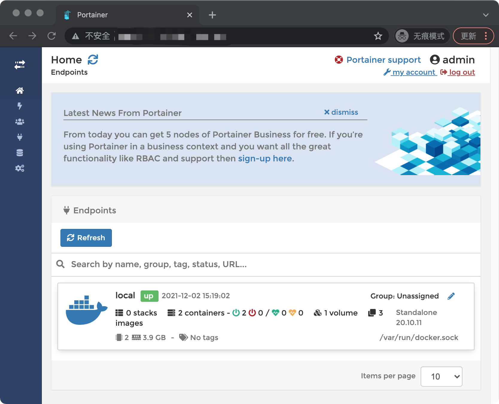
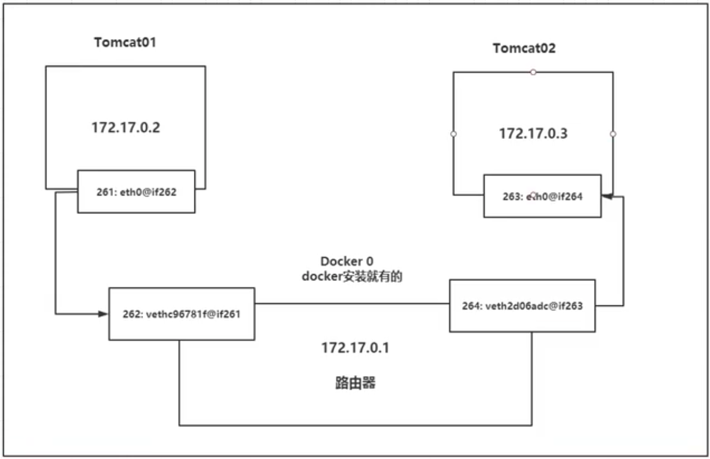

## Docker 架构


- **镜像（Image）**：Docker 镜像（Image），就相当于是一个 root 文件系统。比如官方镜像 ubuntu:16.04 就包含了完整的一套 Ubuntu16.04 最小系统的 root 文件系统。
- **容器（Container）**：镜像（Image）和容器（Container）的关系，就像是面向对象程序设计中的类和实例一样，镜像是静态的定义，容器是镜像运行时的实体。容器可以被创建、启动、停止、删除、暂停等。
- **仓库（Repository）**：仓库可看成一个代码控制中心，用来保存镜像。


​		典型的Linux在启动后，首先将 rootfs 置为 readonly, 进行一系列检查, 然后将其切换为 “readwrite” 供用户使用。在docker中，起初也是将 rootfs 以readonly方式加载并检查，然而接下来利用 union mount 的将一个 readwrite 文件系统挂载在 readonly 的rootfs之上，并且允许再次将下层的 file system设定为readonly 并且向上叠加, 这样一组readonly和一个**writeable的结构构成一个container**的运行目录, 每一个被称作一个Layer。


## Docker 命令


```shell
# 基本
docker search mysql #搜索镜像
docker pull centos #下载镜像
docker images 显示docker

# run
docker run --name mynginx -d nginx:latest
-d #后台运行
-p 80:80 #端口映射
-v /data:/data #加载卷
-it #交互运行，分配伪输入终端，一般添加args： /bin/bash

# 启停操作
docker start 容器id
docker stop 容器id
docker restart 容器id
docker kill 容器id
docker run -it --rm tomcat #用完即删

# rm rmi
docker rm -f #删除
					-l db #删除与db的连接
					-v nginx01 #删除nginx01，并删除挂载的数据卷
docker rm $(docker ps -aq) # 删除所有已经停止的容器
docker rmi 镜像id #删除指定镜像

# pause
docker pause 容器id #暂停容器的所有进程
docker unpause 容器id #恢复容器的所有进程

# create
docker create ... #创建容器，但不启动

# 退出容器不停止
Ctrl + P + Q

# exec 开启新的终端操作
docker exec -d #后台运行
						-it myningx /bin/bash

# attach 进入容器但不开启新的终端
docker attach ...

# ps
docker ps -a #所有
					-f #过滤
					-l #最后创建
					-n 4 #最后4个
					-q #只显示编号
					-s #显示文件大小

# inspect 获取容器的元数据
docker inspect
					-f #指定值
					-s #文件大小
					--type #返回指定值的json文件
					
# top
docker top #容器中的进程信息

# logs
# 跟踪输出(-f)带有时间戳的(-t)十条信息(--tail)
docker logs -f -t --tail 10 容器id

# cp
#将主机/www/runoob目录拷贝到容器96f7f14e99ab的/www目录下。
docker cp /www/runoob 96f7f14e99ab:/www/
#将主机/www/runoob目录拷贝到容器96f7f14e99ab中，目录重命名为www。
docker cp /www/runoob 96f7f14e99ab:/www
#将容器96f7f14e99ab的/www目录拷贝到主机的/tmp目录中。
docker cp  96f7f14e99ab:/www /tmp/

# stats
docker stats #查看docker进程占用的内存

#other
apt-get update
apt-get install vim #安装vim

```

## Docker可视化

通过Portainer可以图形化界面管理



```shell
docker run -d -p 8088:9000 --restart=always -v /var/run/docker.sock:/var/run/docker.sock --privileged=true portainer/portainer
```


## 数据持久化

例如mysql，我们不希望docker删除后数据被删除，则可通过卷挂载来避免数据被删除：

```shell
# conf.d是配置文件 lib/mysql中为mysql数据库的位置
docker run -d -p 3310:3306 -v /home/mysql/conf:/etc/mysql/conf.d -v /home/mysql/data:/var/lib/mysql -e MYSQL_ROOT_PASSWORD=123456 --name mysql01 mysql

# volume
 docker volume ls #列出挂载的卷
 docker volume inspect 卷id #列出卷信息
```

### 	匿名挂载

```shell
docker run -d -v /data mysql #未指定卷名 默认/var/lib/docker/volumes/{卷id}/_data
```

### 	具名挂载

```shell
docker run -d -v myvolume:/data mysql #卷名被命名为myvolume
```

### 读写权限

```bash
# ro readonly 只读（只能通过宿主机操作读写）
# rw readwrite 可读可写
docekr run -d -P --name  nginx02 -v juming-nginx:/etc/nginx:ro nginx
```


### 	链式挂载

```shell
# mysql02所挂载的卷和mysql01相同。即使mysql01被删除，mysql02依旧挂载对应的主机目录
docker run --name mysql02 --volumes-from mysql01 mysql
```


## Dockerfile

默认名称为Dockerfile，通过其可以制作Docker镜像文件，并配置相关环境

```shell
1/FROM # 基础镜像
2/MAINTAINER # 维护者信息
3/ADD # Copy文件，Docker会自动进行解压
4/WORKDIR # 设置当前工作目录 在构建镜像的每一层都会存在
5/VOLUME ["volume01","volume02"] # 设置挂载的卷信息
6/EXPOSE # 端口暴露
7/RUN # 命令行命令，
    # shell格式：命令行
    RUN yum install wget
    # exec格式：等价于 RUN ./test.php dev offline
    RUN ["./test.php", "dev", "offline"]
    # 每次执行都会在docker上多建立一层，可以用&&合并指令，只建立1层镜像
8/CMD # 指定运行命令，只有最后的指令生效，不可追加
		# RUN 是在docker build时运行
		# CMD 是在docker run时运行
9/ENTRYPOINT # 可以追加指令 docker run xxxx -l <--追加命令
10/ONBUILD 
		# 延迟执行。本次建立test镜像不会执行。当新的Dockerfile中采用FROM test时候，会执行ONBUILD指令
11/COPY # 复制到容器之中，没有ADD中的解压操作
12/ENV # 环境配置
13/ARG # 仅对Dockerfile文件内有效，构建好的镜像不存在此环境变量
```


### 	制作Tomcat镜像文件

```shell
# 基础镜像
FROM centos
# 维护者信息
MAINTAINER jackyjinchen<jackyjinchen@163.com>
# 自动解压
ADD jdk-8u161-linux-x64.tar.gz /usr/local/
ADD apache-tomcat-7.0.105.tar.gz /usr/local/
# 安装vim
RUN yum -y install vim
# 工作目录配置
ENV MYPATH /usr/local
WORKDIR $MYPATH
# 配置环境变量
ENV JAVA_HOME /usr/local/jdk1.8.0_161
ENV CLASSPATH $JAVA_HOME/lib/dt.jar:$JAVA_HOME/lib/tools.jar
ENV CATALINA_HOME /usr/local/apache-tomcat-7.0.105
ENV CATALINA_BASE /usr/local/apache-tomcat-7.0.105
ENV PATH $PATH:$JAVA_HOME/bin:$CATALINA_HOME/lib:$CATALINA_HOME/bin
# 端口暴露
EXPOSE 8080
# tomcat日志
CMD /usr/local/apache-tomcat-7.0.105/bin/startup.sh && tail -F /usr/local/apache-tomcat-7.0.105/bin/logs/catalina.out

```

通过build将Dockerfile生成镜像

```shell
# 会自动寻找Dockerfile文件名文件，否则需要 -f
docker build -t mytomcat .
```

文件执行步骤后自动生成image

```shell
[root@ecs-s6-small-1-linux-20200915085655 home]# docker images
REPOSITORY            TAG                 IMAGE ID            CREATED             SIZE
mytomcat              latest              2a9dbcd2d676        14 seconds ago      672MB
```

通过docker run运行容器

```shell
docker run -d -p 9090:8080 --name tomcat01 -v 
# 这里将webapps中的test项目目录挂载出来，可通过修改外部文件，同步到其中
/home/jinchen/build/tomcat/test:/usr/local/apache-tomcat-7.0.105/webapps/test -v
# 挂载tomcat的日志文件，可以通过外部访问日志
/home/jinchen/build/tomcat/tomcatlogs/:/usr/local/apache-tomcat-7.0.105/logs mytomcat

# 可以观察docker的创建历史
docker history 容器id
```

### 	通过commit制作镜像

```shell
# 也可以通过commit将容器作为副本
docker commit -a="name" -m="message" 容器id 镜像命名
```


## Dockerhub

```shell
# 登录dockerhub
docker login -u xxxx -p xxxx
# 提交镜像 名/镜像:版本
docker push jackyjinchen/镜像id:1.0
# 修改tag
docker tag 镜像id jackyjinchen/tomcat:1.0

```


## Docker 网络


172.17.0.1为docker0的路由地址，每启动一个docker则**分配一个ip(桥接模式veth-pair)** ，Docker0直连NAT宿主机物理网卡。



### 	--link(不推荐使用)

微服务之间不能访问，可以通过--link解决网络连通(**仅能单项通过ip来ping通**)

```shell
docker exec -it tomcat02 ping tomcat01 #无法ping通
# ---------> 在tomcat03的hosts配置文件中，将tomcat02进行了映射
docker run -d -P --name tomcat03 --link tomcat02 tomcat
docker exec -it tomcat03 ping tomcat02 #可以ping通
```

### 	create自定义网路

bridge 桥接 | none 不配置网络 | host 和宿主机共享网络 | container 容器网络连通

```shell
docker network ls 列出docker网络

docker run -d -P --name tomcat01 tomcat 
# 等价于(默认桥接)
docker run -d -P --name tomcat01 --net bridge tomcat

# 自定义一个网络 192.168.0.2-->192.168.255.255
docker network create --driver bridge --subnet 192.168.0.0/16 --gateway 192.168.0.1 mynet
# 查看自己创建的网络
docker network inspect mynet
# 发布到自己的网络之中
docker run -d -P --name tomcat01 --net mynet tomcat
```

自定义网络network可以通过ip，可以通过名字ping通。

```shell
docker exec -it tomcat01 ping tomcat02
```

### 	connect网络连接(一个容器，两个IP)

```shell
# 将容器与指定的网络连通
docker network connect NETWORK CONTAINER
```

### 	构建Redis集群

```shell
# 网卡
docker network create redis --subnet 172.38.0.0/16

# 通过脚本创建六个redis配置
for port in $(seq 1 6); \
do \
mkdir -p /mydata/redis/node-${port}/conf
touch /mydata/redis/node-${port}/conf/redis.conf
cat << EOF >/mydata/redis/node-${port}/conf/redis.conf
port 6379
bind 0.0.0.0
cluster-enabled yes
cluster-config-file nodes.conf
cluster-node-timeout 5000
cluster-announce-ip 172.38.0.1${port}
cluster-announce-port 6379
cluster-announce-bus-port 16379
appendonly yes
EOF
done

docker run 0p 637${port}:6379 -p 1637${port}:16379 --name redis-${port} \
-v /mydata/redis/node-${port}/data:/data \
-v /mydata/redis/node-${port}/conf/redis.conf:/etc/redis/redis.conf \
-d --net redis --ip 172.38.0.1${port} redis:5.0.9-alpine3.11 redis-server /etc/redis/redis.conf; \

# 创建集群
redis-cli --cluster create 172.38.0.11:6379 172.38.0.12:6379 172.38.0.13:6379 172.38.0.14:6379 172.38.0.15:6379 172.38.0.16:6379 --cluster-replicas 1
```

### 	构建SpringBoot Docker程序

```shell
#Dockerfile
FROM java:8
COPY *.jar /app.jar
CMD ["--server.port=9090"]
EXPOSE 9090
ENTRYPOINT ["java","-jar","/app.jar"]
```


## Docker Compose

运行多个容器，步骤：

```shell
1. 使用 Dockerfile 定义应用程序的环境。
2. 使用 docker-compose.yml 定义构成应用程序的服务，这样它们可以在隔离环境中一起运行。
3. 最后，执行 docker-compose up 命令来启动并运行整个应用程序。
```

需要运行的主程序 app.py

```python
import time

import redis
from flask import Flask

app = Flask(__name__)
cache = redis.Redis(host='redis', port=6379)


def get_hit_count():
    retries = 5
    while True:
        try:
            return cache.incr('hits')
        except redis.exceptions.ConnectionError as exc:
            if retries == 0:
                raise exc
            retries -= 1
            time.sleep(0.5)


@app.route('/')
def hello():
    count = get_hit_count()
    return 'Hello World! I have been seen {} times.\n'.format(count)
```

配置Dockerfile

```shell
FROM python:3.7-alpine
WORKDIR /code
ENV FLASK_APP app.py
ENV FLASK_RUN_HOST 0.0.0.0
RUN apk add --no-cache gcc musl-dev linux-headers
COPY requirements.txt requirements.txt
RUN pip install -r requirements.txt
EXPOSE 5000
COPY . .
CMD ["flask", "run"]
```

配置docker-compose.yml

```yaml
# yaml 配置
# web：该 web 服务使用从 Dockerfile 当前目录中构建的镜像。然后，它将容器和主机绑定到暴露的端口 5000。此示例服务使用 Flask Web 服务器的默认端口 5000 。
# redis：该 redis 服务使用 Docker Hub 的公共 Redis 映像。
version: '3'
services:
  web:
    build: . 
    ports:
     - "5000:5000"
  redis:
    image: "redis:alpine"
```

执行docker-compose

```shell
docker-compose up
docker-compose down
```

### 	docker-compose.yml

```shell
# docker-compose版本信息
version: '' 
# 服务配置
services:
	服务1:web
		images
		build
		network
		......
	服务2:redis
		......
#其他配置
volume:
......
```

## Swarm

### 	原理：集群管理

如下图所示，swarm 集群由管理节点（manager）和工作节点（work node）构成。

- **swarm mananger**：负责整个集群的管理工作包括集群配置、服务管理等所有跟集群有关的工作。
- **work node**：即图中的 available node，主要负责运行相应的服务来执行任务（task）。


### 	Docker swarm 基本操作

```shell
# docker swarm 广播地址 初始化
docker swarm init --advertise-addr ip地址

# 获取令牌
docker swarm join-token manager
docker swarm join-token worker

# 添加节点--->在子节点输入：
docker swarm join --token xxxxxxxxxxxxx ip地址：端口
$ This mode joined a swarm as a manager/worker

# 列出所有节点
docker node ls
```

Raft协议，保证大多数节点存活。为保证集群可用，至少保证3个主节点，保证大于一台管理节点存活

### 	动态扩缩容scale

```shell
# 启动一个服务 具有扩缩容功能
docker service create -p 8888:80 --name my-nginx nginx
# 查看服务
docker service ls #查看服务
docker service ps n-nginx # 查看具体的replicase，如n-nginx1

# 创建副本数 实现相同
docker service update --replicase 3 my-nginx
docker service scale my-nginx=5

# 配置service运行方式
docker service create --mode replicated tomcat # 默认
docker service create --mode global tomcat # 不可作为replicated服务点
```

集群中任意节点都可以访问该服务，具体服务数量可以动态变化

网络模式PublishMode: ingress # 具有负载均衡

**命令 -> 管理 -> api -> 调度 -> 工作节点(创建Task容器)**


## Docker Stack

集群部署服务：

```shell
# 单机部署 docker-compose
docker-compose up -d wordpress.yml
# 集群部署 Docker Stack
docker stack up deploy wordpress.yml
```


## Docker Secret

配置密码、证书

TBD-----k8s


## Docker Config

配置

TBD-----k8s


## 可参考

docker官方文档：https://docs.docker.com/

菜鸟教程：https://www.runoob.com/docker

docker图解：http://dockone.io/article/783

veth-pair：https://www.cnblogs.com/bakari/p/10613710.html

Docker-compose：https://docs.docker.com/compose/gettingstarted/

Compose-WordPress：https://docs.docker.com/compose/wordpress/

Swarm：https://www.cnblogs.com/skyflask/p/11212452.html

Raft算法：https://www.cnblogs.com/xybaby/p/10124083.html